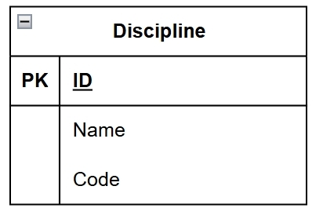

# Номер варианта и название сервиса
Вариант 11. Сервис дисциплин (Discipline Service)

## Добавить дисциплину
Информация, требуемая для создания дисциплины:

| Параметр | Пояснение | Обязательность | Тип | Ограничение | Значение по умолчанию |
| :--- | :--- | :--- | :--- | :--- | :--- |
| name | Полное название | Да | String | Max 255, уникально вместе с code | - |
| code | Код | Да | String | Max 255, уникально вместе с name | - |
| is_active | Статус | Нет | Boolean | - | True |

*Уникальная комбинация параметров:* связка полей `name` и `code` должна быть уникальной.

Информация, возвращаемая при удачном создании:

| Параметр | Тип |
| :--- | :--- |
| id | Integer |
| name | String |
| code | String |

---

## Изменить дисциплину по ID
Параметры запроса:

| Параметр | Пояснение | Обязательность | Тип | Ограничение |
| :--- | :--- | :--- | :--- | :--- |
| id | Идентификатор | Да | Integer | - |
| name | Новое название | Нет | String | Max 255 |
| code | Новый код | Нет | String | - |
| is_active | Новый статус | Нет | Boolean | - |

Информация, возвращаемая при удачном изменении:

| Параметр | Тип |
| :--- | :--- |
| id | Integer |
| status | String (значение: "updated") |

---

## Удаление дисциплины по ID
Вернет True, если дисциплина была закрыта (удалена), иначе вернет False. Фактически запись из БД не удаляется, а реализуется через булевое поле is_active.

---

## Получить дисциплину по ID
Возвращаемая информация:

| Параметр | Пояснение | Тип |
| :--- | :--- | :--- |
| id | Идентификатор | Integer |
| name | Название | String |
| code | Код | String |
| is_active | Статус | Boolean |

---

## Получить список дисциплин по заданным параметрам
Параметры запроса:

| Параметр | Пояснение | Тип |
| :--- | :--- | :--- |
| name | Поиск по названию | String |
| is_active | Фильтр по статусу | Boolean |

Возвращаемая информация:

| Параметр | Тип |
| :--- | :--- |
| id | Integer |
| name | String |
| code | String |
| is_active | Boolean |

---

## ER-диаграмма

